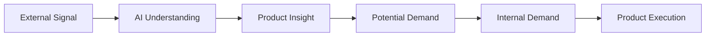
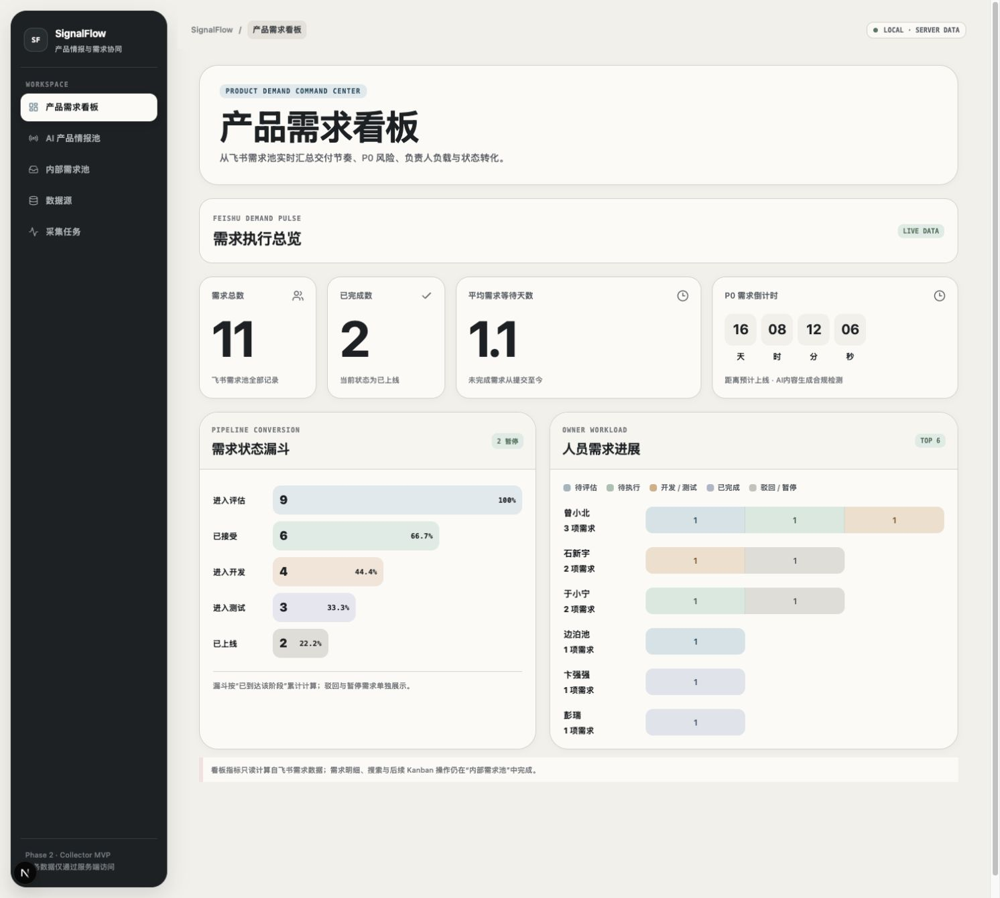
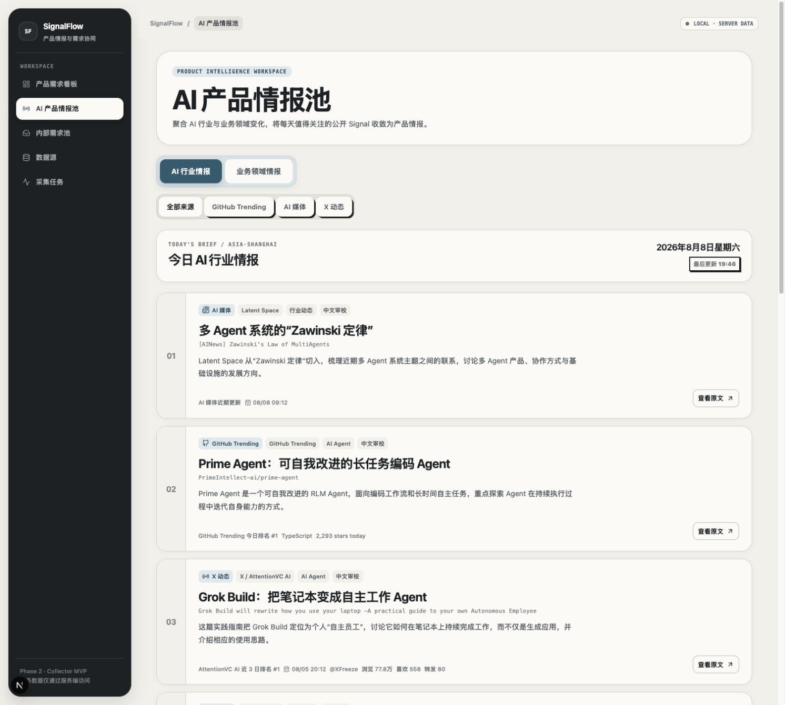
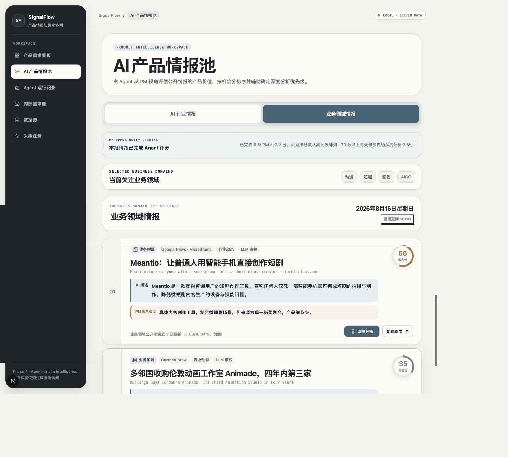
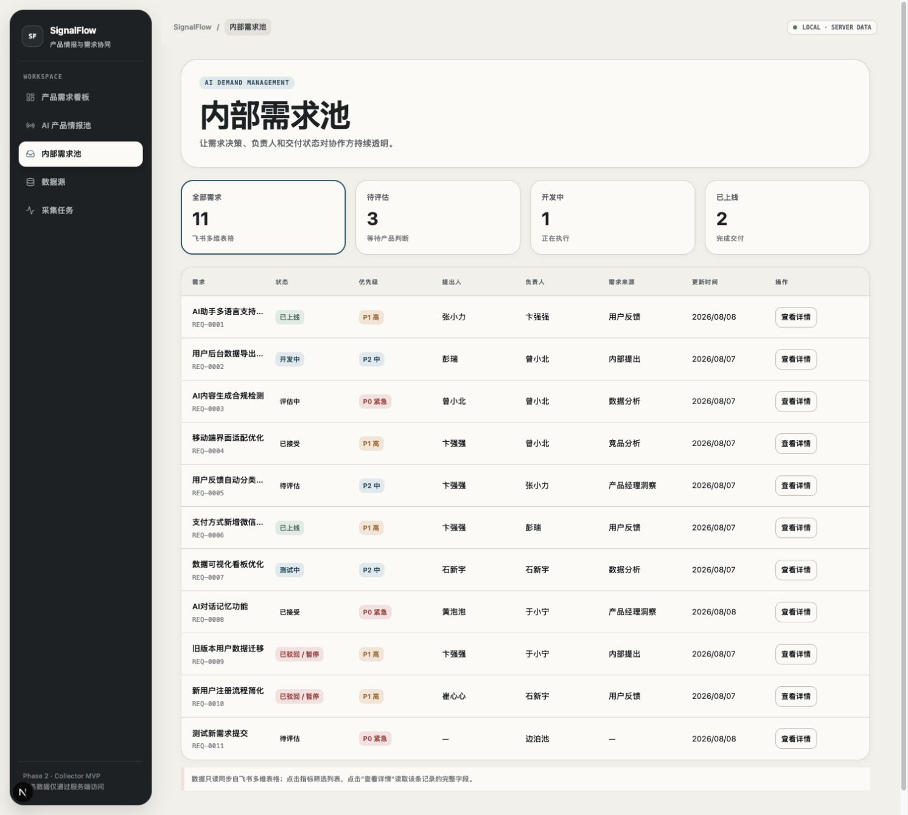
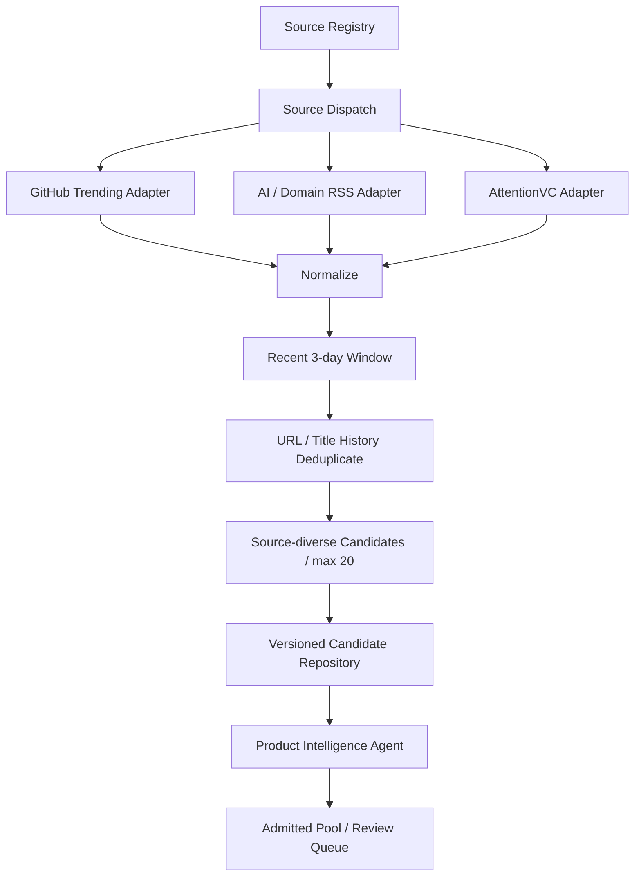
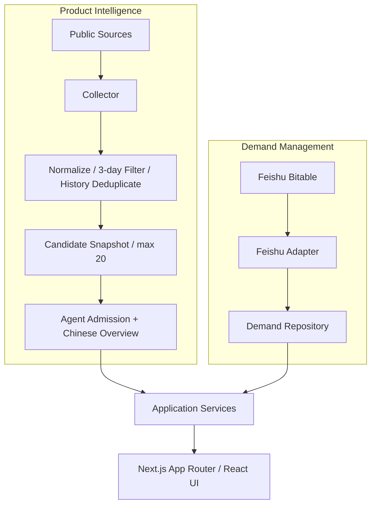
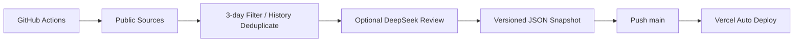
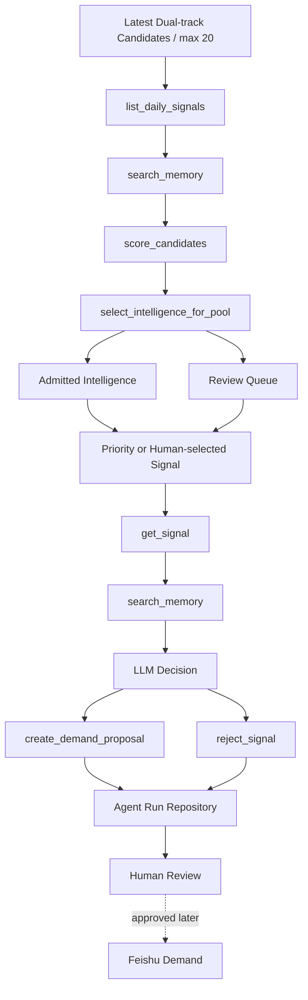

<div align="center">
  <h1>SignalFlow</h1>
  <p><strong>AI 产品情报与需求协同工作台</strong></p>
  <p>让有价值的外部信号主动找到产品经理，并进入可追踪的内部需求执行链路。</p>
</div>

<p align="center">
  
  
  
  
  
</p>

<p align="center">
  <a href="https://bbcpmsignalflow.vercel.app/"><strong>在线体验 SignalFlow →</strong></a>
</p>

> [!NOTE]
> SignalFlow 当前处于 **Phase 4 / Agent-driven Intelligence MVP**。Collector 负责公开信号采集与去重，单一 Product Intelligence Agent 负责中文概述、Memory 去重、机会评分、动态情报准入和高分自动深度分析；正式需求写回仍由产品经理人工确认。

## SignalFlow 是什么

SignalFlow 是一个面向 AI 产品经理的长期产品作品集。它把两类原本割裂的工作放到同一工作台：

- **外部产品情报**：持续跟踪模型能力、AI Agent、AI Coding、多模态、AI 产品，以及动漫、短剧、影视与 AIGC 生产领域的变化。
- **内部需求协同**：从飞书多维表格读取需求，透明展示评估、负责人、优先级、开发、测试与上线进度。

产品最终希望形成这条闭环：



### 为什么做这个项目

| 真实问题 | SignalFlow 的产品回应 |
| --- | --- |
| AI 产品信息依赖产品经理主动浏览，情报分散且容易错过 | 配置化 Source Registry、近 15 日滚动候选、跨批次去重和 Agent 动态准入 |
| 需求通过表单、聊天和会议提出，提交后状态不透明 | 统一需求池、状态筛选、详情页与执行看板 |
| 外部情报与内部需求缺少连接 | Product Intelligence Agent 为每条候选评分，高分自动深度分析，再转为可审阅候选需求 |
| Demo 容易依赖伪造数据或泄露 Secret | 公开来源快照可审计，飞书凭据仅保留在服务端 |

## 当前可以体验什么

| 路由 | 产品模块 | 当前能力 |
| --- | --- | --- |
| `/` | 产品需求看板 | 需求总数、已完成数、平均等待天数、P0 秒级倒计时、状态漏斗、人员进展 |
| `/intelligence` | AI 产品情报池 | Agent 已入选 / 待审候选、双轨来源筛选、中文概述、机会评分、深度分析和原文追溯 |
| `/agent` | Agent 决策审计 | 动态准入、评分拆解、Tool Use、Memory、高分自动深度分析和候选需求草稿 |
| `/demands` | 内部需求池 | 飞书实时读取、状态指标筛选、优先级、提出人、负责人和详情入口 |
| `/demands/[id]` | 需求详情 | 展示该条飞书记录映射后的完整字段与规范化时间 |
| `/sources` | 数据源 | 按情报轨道管理 Source Registry、来源健康度与本地开关 |
| `/tasks` | 采集任务 | 双轨任务配置、AI 概述覆盖率、来源可用率、重试监控与 badcase 队列 |

## 产品实景

以下画面均来自当前可运行的 SignalFlow 本地应用，不是设计稿或静态概念图。

### 产品需求看板：先看风险，再进入需求细节



首页将飞书需求池转化为产品管理视角：需求总数、已完成数、平均等待天数和 P0 秒级倒计时负责提示风险；状态漏斗与人员进展负责解释需求卡在哪里、团队负载如何分布。它不是另一个导航首页，而是产品经理每天进入系统后的决策入口。

### AI 行业情报：把分散信号整理成可读的今日 Brief



AI 行业情报将 GitHub Trending、AI 媒体与 X 动态收敛到同一阅读流。每条信号保留来源、原始标题、真实发布时间与原文入口，并在证据充分时提供 AI 中文概述和公开热度，让中文产品经理先快速判断“这是什么”，再决定是否深入阅读。

### 业务领域情报：在技术趋势之外理解真实生产场景



业务领域轨道当前聚焦动漫、短剧、影视与 AIGC。它强调制作流程、内容生产、商业模式和行业变化，避免产品情报只围绕模型参数与技术发布，帮助产品经理把 AI 能力放回具体业务场景中判断机会。

### 内部需求池：让提出、评估与交付状态持续透明



需求列表直接读取飞书多维表格，通过状态指标、P0–P3 优先级、提出人、负责人、需求来源和更新时间建立统一视图。点击“查看详情”可以继续查看该条飞书记录映射后的完整信息，减少依赖聊天和会议反复同步进度。

### 产品体验设计

- 简体中文优先，技术名词保留 AI、API、RSS、GitHub、LLM 等常用表达。
- 低饱和 Bento Grid：暖灰画布、象牙白信息面、石墨侧栏和雾霾蓝交互色。
- 情报页强调连续阅读与来源追溯，需求页强调高密度扫描与状态识别。
- 公开环境只读：不能修改 Source Registry、计划时间或手动触发采集。

完整视觉规范见 [`docs/design/bento-grid-DESIGN.md`](docs/design/bento-grid-DESIGN.md)。

## 情报数据源

### AI 行业情报

| 来源组 | 当前来源 | 选择目标 |
| --- | --- | --- |
| GitHub Trending | GitHub Trending | AI Agent、AI Coding、模型工具与 AI Native 项目 |
| AI 媒体 | OpenAI、Google DeepMind、Hugging Face、TLDR AI、Smol AI、Latent Space、MIT Technology Review AI | 官方能力更新、工程趋势和产品动态 |
| X 动态 | AttentionVC AI 公共端点 | AI 从业者与产品实践的高关注信号 |

### 业务领域情报

当前聚焦 **动漫、短剧、影视、AIGC**，来源包括：

- Cartoon Brew
- No Film School
- arXiv `cs.CV`
- Google News · Microdrama
- Google News · AIGC Production

两条情报轨道分别维护自己的采集时间和关注领域，并最多准备 20 条 Agent 候选。`briefingDate` 表示 Asia/Shanghai 当天生成的情报批次；候选内容限定为近 15 个上海自然日，原始发布时间单独保留。Collector 会优先排列具体的新产品、新功能、Agent、Skill、工具与应用案例；已在历史批次出现的规范化 URL 或标题不会再次录用，避免用户重复阅读同一情报。

## Collector 如何工作



Collector 的工程约束：

- 默认只执行 `dry-run`，只有显式 `--write` 才更新每日快照。
- 单个来源失败不会中止整批采集；超过半数来源失败则禁止写入。
- URL 规范化与单批次指纹去重在来源适配器之后统一完成；持久化 Seen Index 再按 URL 和规范化标题执行跨批次去重。
- 当天批次只从近 15 个上海自然日的候选中选取，保留每条情报的真实发布时间。
- 产品发布、功能更新、Agent、Skill、插件、工具和真实应用案例优先于收购、融资、观点评论等泛新闻。
- AI 媒体、GitHub Trending 与 X 动态有独立配额，避免单一来源占满候选集。
- `summaryZh` 只描述“这是什么、主要讲什么、具有什么能力”，排名与入选依据保存在独立字段。
- Collector 只准备低成本候选；Product Intelligence Agent 基于公开标题、摘要与页面描述统一生成中文概述、机会评分和准入判断，页面不会实时调用 LLM。
- LLM 返回内容会经过 JSON 修复与一次精简重试；仍无法可靠生成时保留来源摘要并标记为“待审校”，不使用空泛模板伪装成 AI 概述。
- 每次写入快照会保存脱敏的审校质量报告，包括覆盖率、批次、请求、重试、耗时与失败类型；`/tasks` 可直接查看评测指标和 badcase，不记录 Prompt、原文正文或 API Key。
- 公开热度只使用来源可验证的 GitHub stars、X 浏览/互动等指标；没有证据时明确显示暂无公开热度。

## 系统架构



内部需求调用边界：

```text
React Component
  → Application Service / Demand Repository
  → Feishu Adapter
  → Next.js Server
  → Feishu OpenAPI
  → Bitable
```

关键架构决策：

- React 页面不直接调用飞书 OpenAPI，也不理解 Bitable 字段结构。
- `src/lib/feishu` 只负责鉴权、请求、分页、响应映射和安全错误翻译。
- 页面通过 `src/repositories` 中的领域接口访问数据。
- AI 情报和内部需求属于两个独立数据边界。
- File Repository 可在不重写页面的情况下替换为 PostgreSQL。

更多说明见 [`docs/architecture/system-overview.md`](docs/architecture/system-overview.md) 和 [`docs/architecture/feishu-integration-plan.md`](docs/architecture/feishu-integration-plan.md)。

## 数据存在哪里

AI 产品情报当前使用可公开审计的版本化 JSON：

```text
data/intelligence/
├── technical/
│   └── YYYY-MM-DD.json
├── technical-latest.json
├── technical-seen.json
├── domain/
│   └── YYYY-MM-DD.json
├── domain-latest.json
└── domain-seen.json
```

`*-seen.json` 只保存公开情报的 URL 与原始标题，用于跨批次去重；它不包含 API Key、飞书数据或其他 Secret。

内部需求不进入 Git，运行时由服务端从你的飞书多维表格读取。克隆仓库的使用者不会获得仓库作者的飞书凭据或表格访问权限。

## 快速开始

### 环境要求

- Node.js `22.13+`（推荐 Node.js 24）
- pnpm `11.16+`
- Git

### 只体验产品情报

产品情报使用仓库内快照，不配置飞书也可以启动：

```bash
git clone https://github.com/bbc804208302/AIPM-.git
cd AIPM-
pnpm install
pnpm dev
```

打开 [http://localhost:3000](http://localhost:3000)。AI 产品情报池、数据源和采集任务可读取公开配置；内部需求池会提示飞书尚未配置。

### 接入自己的飞书需求表

```bash
cp .env.example .env.local
```

在 `.env.local` 中配置：

| 变量 | 用途 | 是否进入浏览器 |
| --- | --- | --- |
| `FEISHU_APP_ID` | 飞书自建应用 ID | 否 |
| `FEISHU_APP_SECRET` | 飞书自建应用 Secret | 否 |
| `FEISHU_BITABLE_APP_TOKEN` | 多维表格 App Token | 否 |
| `FEISHU_DEMAND_TABLE_ID` | 内部需求表 ID | 否 |
| `LLM_API_KEY` | 可选 LLM 审校服务的 API Key | 否 |
| `LLM_API_BASE_URL` | OpenAI 兼容 API 地址；默认 `https://api.openai.com/v1` | 否 |
| `LLM_MODEL` | 审校模型；默认 `gpt-4.1-mini` | 否 |
| `SIGNALFLOW_LLM_REVIEW` | 设置为 `true` 后，在写入快照前调用 LLM；默认关闭 | 否 |
| `SIGNALFLOW_OPPORTUNITY_AGENT` | 设置为 `true` 后允许本地或 GitHub Action 运行机会 Agent | 否 |

推荐的需求表字段：

| 字段组 | 字段名 |
| --- | --- |
| 标识与正文 | `需求ID`、`需求名称`、`需求描述` |
| 流程 | `当前状态`、`优先级`、`需求来源`、`来源情报ID` |
| 人员 | `提出人`、`产品负责人`、`开发负责人` |
| 时间 | `提交时间`、`更新时间`、`预计上线时间`、`实际上线时间` |

状态映射支持：`待评估`、`评估中`、`已接受`、`待开发`、`开发中`、`测试中`、`已上线`、`已驳回`、`已暂停`。优先级支持 `P0`–`P3`。

> [!IMPORTANT]
> `.env.local` 已被 Git 忽略。不要将真实 Secret 写入 README、Issue、截图、客户端代码或任何 `NEXT_PUBLIC_*` 变量。

## 运行 Collector

| 命令 | 行为 | 是否写快照 |
| --- | --- | --- |
| `pnpm collector:dry-run` | 验证 AI 行业来源、去重结果和候选上限 | 否 |
| `pnpm collector:write` | 采集并保存 AI 行业今日快照 | 是 |
| `pnpm exec tsx scripts/collect-intelligence.ts --dry-run --track domain` | 验证业务领域采集 | 否 |
| `pnpm collector:write:domain` | 采集并保存业务领域今日快照 | 是 |

本地维护者可以通过 `/sources` 调整来源开关，通过 `/tasks` 修改时间与业务领域并手动采集。生产环境中的这些写操作会返回 `403`，避免公开访客修改仓库配置或运行任务。

### 可选 LLM 中文审校

将以下变量加入本地 `.env.local`，或作为 GitHub Actions Secrets 配置；不要写入 Git：

```bash
SIGNALFLOW_LLM_REVIEW=true
LLM_API_KEY=your_provider_key
LLM_API_BASE_URL=https://api.deepseek.com
LLM_MODEL=deepseek-v4-flash
```

以上示例使用 DeepSeek；也可以替换为其他 OpenAI 兼容服务。当前每日主链路由 Product Intelligence Agent 处理最多 20 条候选，并只接收公开来源标题、摘要及页面中可审计的公开描述。旧的独立 LLM 审校仍保留为本地兼容能力，但 GitHub Collector 不再重复调用它，避免中文审校与 Agent 准入产生双份 API 消耗。普通网页访客不会调用 LLM，也不会暴露 API Key；下载本项目的其他人必须自行配置自己的 Key。

仓库提供两条 GitHub Actions 工作流：AI 行业情报每天 `08:17`、业务领域情报每天 `08:45` 运行，时区均为 `Asia/Shanghai`。它们只提交 `data/intelligence` 中发生变化的快照；GitHub 调度可能有少量排队延迟。



本地 `/tasks` 调整时间会同步更新对应工作流文件，只有将该变更提交并合并到 `main` 后，GitHub 上的定时任务才会采用新时间。Vercel 公开环境保持只读。

## Product Intelligence Agent

Agent 不是把一次 Prompt 包装成按钮，而是直接参与情报池主流程。同一个 Agent 使用两种受控运行模式：`daily-triage` 决定情报准入，`single-signal` 对高分或人工选择的内容做深度分析：



工程约束：

- Agent 准入必须覆盖最多 20 条最新双轨候选，先逐条检索 Memory，再生成中文概述并按业务相关性、新颖性、用户价值、可行动性与证据质量评分。
- 机会总分使用固定权重计算，公开热度仅占 5%，历史重复风险会扣分；Agent 不能为了凑数推荐低价值内容。
- 70 分以上自动进入深度分析，每天最多 3 条；50–69 分进入情报池并等待人工选择，低分内容进入待审候选。
- 深度分析必须先读取 Signal，再检索历史 Memory，不能跳过证据直接生成需求。
- Agent 只接收 Intelligence Repository 中的公开情报，不读取飞书私有需求正文。
- 每次运行持久化模型、耗时、工具输入/输出摘要、Memory 命中与最终决策；不保存思维链。
- `create_demand_proposal` 只创建等待确认的候选需求，不会自动写入飞书。
- Vercel 在线作品集只读，避免陌生访客消耗维护者的 LLM 配额；运行可由本地维护者或 GitHub Actions 手动触发。

本地运行：

```bash
SIGNALFLOW_OPPORTUNITY_AGENT=true
pnpm agent:triage
pnpm agent:opportunity --signal <LATEST_SIGNAL_ID>
```

GitHub 的 **SignalFlow Daily Intelligence Agent** 工作流每天 `09:15` 自动扫描当日双轨候选，完成动态准入，并对 70 分以上的内容自动执行最多 3 条深度分析。手动工作流仍可接受任意候选的 `signal_id`。两者都使用仓库 Secret 调用 LLM，只提交脱敏后的 `data/agent/runs.json`；Vercel 随后自动展示真实情报池和运行记录。

## 开发与验证

```bash
pnpm lint
pnpm typecheck
pnpm test
pnpm build
```

也可以运行完整检查：

```bash
pnpm check
```

当前测试覆盖：

- Collector registry、Normalization、近 15 日窗口、产品情报预排序、单批次与跨批次去重、最多 20 条双轨候选
- 原文上下文提取、LLM JSON 修复与重试、审校内容保护和公开热度计算
- Product Intelligence Agent 中文概述、动态准入、固定权重评分、自动深度分析上限、工具顺序、Memory 召回、候选需求门控与 File Repository
- 飞书 token 缓存、并发刷新、分页、限流与安全错误
- 飞书字段映射、File Repository 和需求看板指标

## 部署

SignalFlow 使用 Next.js 服务端能力，推荐通过 Vercel 或其他支持 Node.js 的平台部署，而不是使用纯静态 GitHub Pages。

Vercel 部署流程：

1. Fork 或推送仓库到自己的 GitHub。
2. 在 Vercel 中导入仓库并选择 Next.js Preset。
3. 如需内部需求池，在 Vercel Environment Variables 中配置自己的飞书变量。
4. 将生产分支设为 `main` 并部署。

生产部署只读取已提交的情报快照。定时采集由 GitHub Actions 更新快照，新的提交再触发站点部署。

## 项目结构

```text
src/
├── app/                 # App Router 页面与服务端 API
├── agent/               # Product Intelligence Agent、动态准入与受控 Tool Use
├── collector/           # Source Registry、Adapter、Normalize、候选准备
├── components/          # 布局、情报、需求、数据源与任务组件
├── lib/feishu/          # Server-only Feishu OpenAPI boundary
├── repositories/        # 领域接口、Feishu 与 File 实现
├── services/            # Application use cases
├── styles/              # Design Token 与 Bento Grid 视觉层
└── types/               # 稳定领域类型

data/intelligence/       # 可审计的每日情报快照
data/agent/              # 脱敏 Agent Run 与历史决策 Memory
docs/                    # 架构、产品、设计与参考项目说明
.codex/skills/           # SignalFlow Collector Skill
.github/workflows/       # 双轨采集、每日机会初筛与手动深度分析工作流
```

## 当前边界与路线图

### 已实现

- [x] Next.js 产品工作区与六个核心入口
- [x] AI 行业 / 业务领域双轨情报
- [x] 14 个公开来源、Registry、Dispatch、Normalization 与 Deduplication
- [x] 近 15 日候选、历史已展示去重、产品情报优先级、最多 20 条候选与版本化 File Repository
- [x] DeepSeek / OpenAI 兼容中文审校、失败恢复与公开热度
- [x] 飞书 Demand Repository、需求详情和产品需求看板
- [x] 本地任务控制、公开环境只读和 GitHub Actions 工作流
- [x] AI 质量评测、badcase 队列与运行指标
- [x] Product Intelligence Agent 动态准入、中文概述、机会评分、高分自动深度分析、Tool Use、Memory 与候选需求
- [x] Collector Skill、架构文档、设计规范和自动化测试

### 下一阶段

- [ ] 候选需求人工批准与飞书写回
- [ ] Agent Eval 数据集、决策准确性与 Prompt 版本对比
- [ ] Planner / Reviewer 多 Agent 实验（仅在单 Agent 指标稳定后）
- [ ] 飞书需求写回、缓存与 webhook 策略
- [ ] PostgreSQL Intelligence Repository 实现
- [ ] 通知与高价值情报 Deep Research

当前阶段不实现 MCP、自动飞书写回、复杂需求自动化或飞书机器人推送。

## 安全设计

- 所有飞书凭据只在服务端读取。
- `.env.local` 与所有 `.env*` 真实值不进入 Git。
- 页面不打印 token、App Secret 或完整敏感业务正文到日志。
- Collector 默认 dry-run，生产 Web 环境禁止手动写入。
- Agent 不保存思维链，生产 Web 环境禁止访客调用 LLM 或写入 Memory。
- 飞书访问范围由使用者自己的应用权限和表格授权决定。
- 公开 Demo 应使用独立飞书应用与脱敏或虚构需求表。

## 参考项目与许可证注意事项

SignalFlow 不是以下项目的 Fork。调研笔记保存在 [`docs/references`](docs/references/)：

- [leiting-eric/DailyBrief](https://github.com/leiting-eric/DailyBrief) — MIT。选择性参考 Source Registry、dispatch、RSS、GitHub Trending、AttentionVC、normalization 与容错模式，并保留 attribution。
- [SANSAN0/TrendRadar](https://github.com/SANSAN0/TrendRadar) — GPL-3.0。仅作产品和系统架构研究，不复制实现。
- [assafelovic/gpt-researcher](https://github.com/assafelovic/gpt-researcher) — Apache-2.0。仅作为未来高价值信号研究管线参考。
- [makeplane/plane](https://github.com/makeplane/plane) — 仅研究需求详情、状态、Kanban、Timeline 与过滤交互。

SignalFlow 自身当前是公开的个人作品集项目，尚未选择正式开源许可证。在稳定版发布前会补充许可证；在此之前，如需分发或商业复用，请先联系仓库作者。

## 开发协作

任何 Codex 或自动化开发代理修改仓库前，都必须先阅读 [`AGENTS.md`](AGENTS.md)。工程使用 `feat/*` 功能分支，不建立复杂的 develop / staging / release 分支。

项目仓库：[bbc804208302/AIPM-](https://github.com/bbc804208302/AIPM-)
